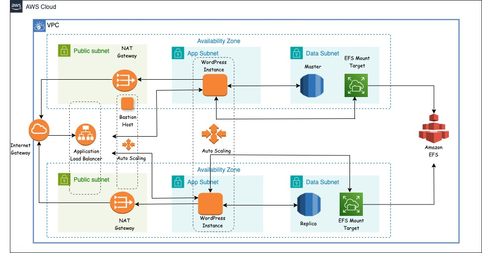

# Deploying a Highly Available WordPress Application on AWS with Terraform

Thanks for visiting!

In this workshop, we will walk through the steps to deploy a highly available and scalable WordPress application on AWS using Terraform. To read more about it, please refer to the official paper, [Highly Available Web Application Workshop](https://catalog.us-east-1.prod.workshops.aws/workshops/3de93ad5-ebbe-4258-b977-b45cdfe661f1/en-US/introduction/overview).

### Architecture Diagram




### Deployed Web App


## Providers

| Name | Version |
|------|---------|
| <a name="requirement_terraform"></a> [terraform](#requirement\_terraform) | >= 1.0.0 |
| <a name="requirement_aws"></a> [aws](#requirement\_aws) | >= 4.67.0 |

## Modules

| Name | Source |
|------|------|
[vpc module](https://registry.terraform.io/modules/terraform-aws-modules/vpc/aws/latest) | ./modules/vpc |
[rds module](https://registry.terraform.io/modules/terraform-aws-modules/rds/aws/latest) | ./modules/rds |
[efs module](https://registry.terraform.io/modules/terraform-aws-modules/efs/aws/latest) | ./modules/efs |
[wordpress module](https://registry.terraform.io/modules/terraform-aws-modules/autoscaling/aws/latest) | ./modules/wordpress |

## Resources

| Name | Type |
|------|------|
| [aws_db_instance.main](https://registry.terraform.io/providers/hashicorp/aws/latest/docs/resources/db_instance) | resource |
| [aws_db_subnet_group.main](https://registry.terraform.io/providers/hashicorp/aws/latest/docs/resources/db_subnet_group) | resource |
| [aws_efs_file_system.wordpress](https://registry.terraform.io/providers/hashicorp/aws/latest/docs/resources/efs_file_system) | resource |
| [aws_efs_mount_target.wordpress](https://registry.terraform.io/providers/hashicorp/aws/latest/docs/resources/efs_mount_target) | resource |
| [aws_security_group](https://registry.terraform.io/providers/hashicorp/aws/latest/docs/resources/security_group.html) | resource |
| [aws_vpc.vpc](https://registry.terraform.io/providers/hashicorp/aws/latest/docs/resources/vpc.html) | resource |
| [aws_internet_gateway.igw](https://registry.terraform.io/providers/hashicorp/aws/latest/docs/resources/internet_gateway.html) | resource |
| [aws_route_table](https://registry.terraform.io/providers/hashicorp/aws/latest/docs/resources/route_table.html) | resource |
| [aws_route_table_association](https://registry.terraform.io/providers/hashicorp/aws/latest/docs/resources/route_table_association.html) | resource |
| [aws_eip.nat](https://registry.terraform.io/providers/hashicorp/aws/latest/docs/resources/eip.html) | resource |
| [aws_nat_gateway.nat](https://registry.terraform.io/providers/hashicorp/aws/latest/docs/resources/nat_gateway.html) | resource |
| [aws_subnet](https://registry.terraform.io/providers/hashicorp/aws/latest/docs/resources/subnet.html) | resource |
| [aws_security_group](https://registry.terraform.io/providers/hashicorp/aws/latest/docs/resources/security_group.html) | resource |
| [aws_launch_template.wordpress](https://registry.terraform.io/providers/hashicorp/aws/4.2.0/docs/resources/launch_template) | resource |
| [aws_autoscaling_group.wordpress](https://registry.terraform.io/providers/hashicorp/aws/latest/docs/resources/autoscaling_group.html) | resource |
| [aws_autoscaling_policy.wordpress_target_tracking](https://registry.terraform.io/providers/hashicorp/aws/latest/docs/resources/autoscaling_policy.html) | resource |
| [aws_lb.wordpress](https://registry.terraform.io/providers/hashicorp/aws/latest/docs/resources/lb.html) | resource |
| [aws_lb_target_group.wordpress](https://registry.terraform.io/providers/hashicorp/aws/latest/docs/resources/lb_target_group.html) | resource |
| [aws_lb_listener.http](https://registry.terraform.io/providers/hashicorp/aws/latest/docs/resources/lb_listener.html) | resource |


### Remote Backend with AWS S3 and Dynamo DB

```
terraform {
  backend "s3" {
    bucket         = "wordpress-terraform-state"
    key            = "terraform/state"
    region         = "us-east-1"
    dynamodb_table = "terraform-lock"
    encrypt        = true
  }
}
```

## Inputs

| Name | Description | Type | 
|------|-------------|------|
| <a name="aws_region"></a> [aws_region](#input\_aws\_region) | deployment region | `string` | 
| <a name="project_name"></a> [project_name](#input\project\name) | project name | `string` | 
| <a name="vpc_cidr"></a> [vpc_cidr](#input\vpc\cidr) | project name | `string` | 
| <a name="azs"></a> [azs](#input\azs) | availability zones | `list(string)` |
| <a name="public_subnet_cidrs"></a> [public_subnet_cidrs](#input\public\subnet\cidrs) | public subnet cidr  | `list(string)` | 
| <a name="private_app_subnet_cidrs"></a> [private_app_subnet_cidrs](#input\private\app\subnet\cidrs) | private app subnet cidr | `list(string)`| 
| <a name="private_data_subnet_cidrs"></a> [private_data_subnet_cidrs](#input\private\data\subnet\cidrs) | private data subnet cidr | `list(string)` | 
| <a name="db_instance_class"></a> [db_instance_class](#input\db\instance\class) | db instance class | `string` | 
| <a name="db_name"></a> [db_name](#input\db\name) | db name | `string` | 
| <a name="db_username"></a> [db_username](#input\db\username) | db username | `string` | 
| <a name="db_password"></a> [db_password](#input\db\password) | db password | `string` | 
| <a name="ssh_ip"></a> [ssh_ip](#input\ssh\ip) | ssh ip | `string` | 
| <a name="ami_id"></a> [ami_id](#input\ami\id) | ami id for EC2 instance | `string` | 
| <a name="instance_type"></a> [instance_type](#input\instance\type) | instance type for EC2 instance | `string` | 
| <a name="asg_desired_capacity"></a> [asg_desired_capacity](#input\asg\desired\capacity) | auto scaling desired capacity | `number` | 
| <a name="asg_max_size"></a> [asg_max_size](#input\asg\max\size) | auto scaling group max size | `number` | 
| <a name="asg_min_size"></a> [asg_min_size](#input\asg\min\size) | auto scaling group min size | `number` | 

## Outputs

| Name | Description |
|------|-------------|
| <a name="dns_name"></a> [dns\_name](#output\_dns_\_name_) | dns name  |
| <a name="efs_id"></a> [efs\_id](#output\_efs\_id) | efs id |
| <a name="endpoint"></a> [endpoint](#output\_endpoint) | rds endpoint|
| <a name="public_subnet_ids"></a> [public_subnet_ids](#output\_public\_subnet\_ids) | public subnet cidr |
| <a name="private_app_subnet_ids"></a> [private_app_subnet_ids](#output\_private\_app\_subnet\_ids) | private app subnet cidr |
| <a name="private_data_subnet_ids"></a> [private_data_subnet_ids](#output\_private\_data\_subnet\_ids) | private data subnet cidr  |


### Environment specific directories 

```
├── environments/
│   ├── development/
│   │   └── terraform.tfvars
│   ├── production/
│   │   └── terraform.tfvars
│   └── global/
│       └── s3/
│           ├── main.tf
│           └── outputs.tf
└── modules/
    ├── vpc/
    │   ├── main.tf
    │   ├── outputs.tf
    │   └── variables.tf
    ├── rds/
    │   ├── main.tf
    │   ├── outputs.tf
    │   └── variables.tf
    ├── efs/
    │   ├── main.tf
    │   ├── outputs.tf
    │   └── variables.tf
    └── wordpress/
        ├── main.tf
        ├── outputs.tf
        └── variables.tf


```

### Link

[Medium Blog](https://www.markdownguide.org)
